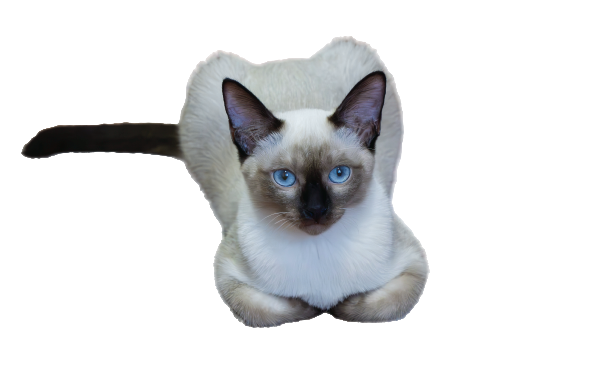

<!-- markdownlint-disable first-line-h1 -->

<!--  -->

# **空白的窝** <small>@薯条🍟&薯饼🫓</small>

<!-- > 一个神奇的猫窝。

- 简单、轻便 (压缩后 ~21kB)
- 无需生成 html 文件
- 众多主题 -->

[GitHub](https://github.com/KKingwang)
[Bilibili](https://space.bilibili.com/343649302)
[Get Started](#你好 ':class=custom-button')